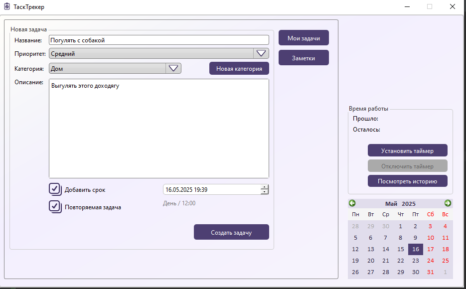
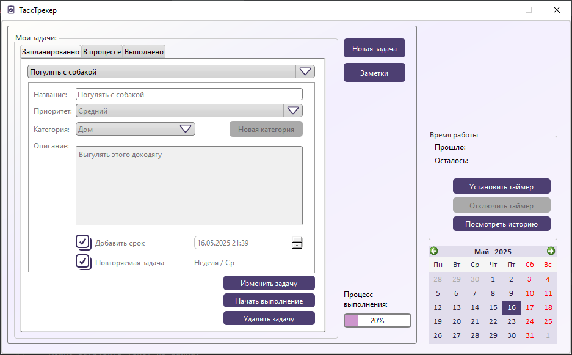
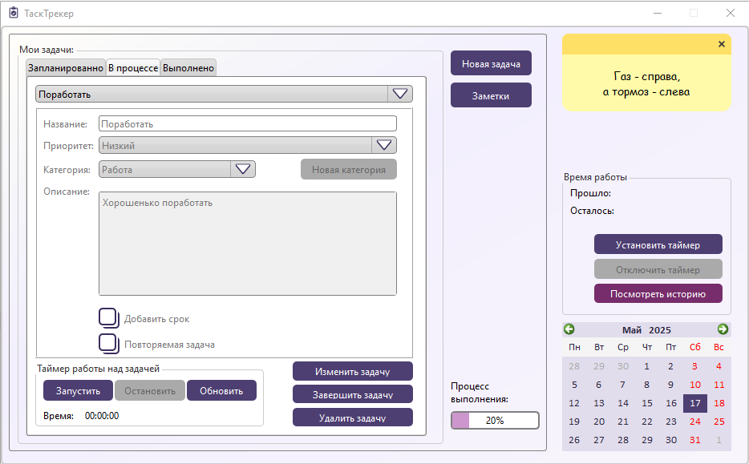
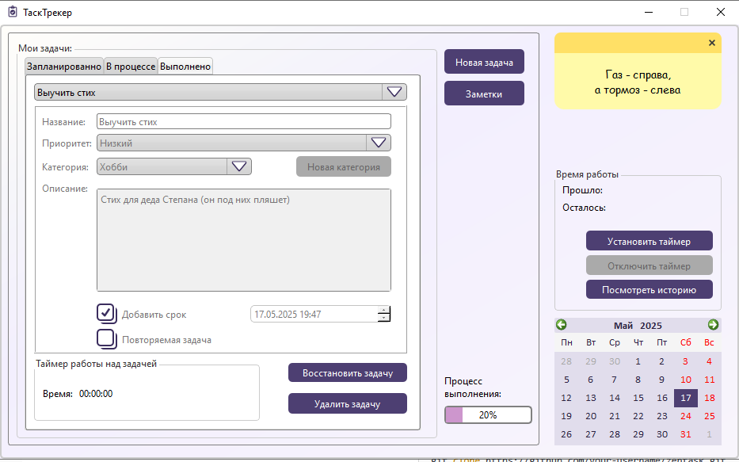
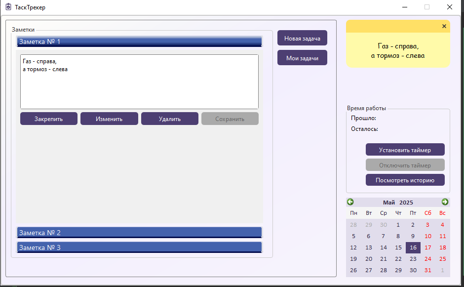
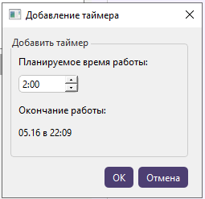
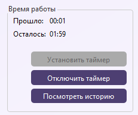

# ZenTask

**ZenTask** — это десктопное приложение для учёта задач, контроля отработанного времени и повышения продуктивности.  
Создано на **Python** с графическим интерфейсом **PySide6** и базой данных **PostgreSQL**.

---

## Основной функционал

### 1. Добавление новой задачи

- Выбор категории (с возможностью добавления своей)
- Приоритет и дедлайн
- Повтор задачи (по дню недели, месяцу, времени или их комбинации)
- Имя и описание задачи
 


---

### 2. Отслеживание задач

Задачи делятся на:
- **Запланированные**
- **В процессе**
- **Выполненные**

У каждой категории отображается прогресс-бар выполнения.

#### 2.1 Запланированные задачи

- Выбор из выпадающего списка
- Редактирование задачи
- Перевод в статус "в процессе"
- Удаление



#### 2.2 Задачи в процессе

- Выбор задачи
- Редактирование, завершение, удаление
- Управление таймером задачи (запуск, пауза, обновление)



#### 2.3 Выполненные задачи

- Выбор задачи
- Восстановление (в запланированные или в процессе)
- Удаление



---

### 3. Заметки

- Создание и сохранение
- Редактирование и удаление
- Закрепление заметки справа на экране



---

### 4. Общий таймер работы

- Установка желаемого времени работы
- Отключение таймера вручную
- История с общей суммой отработанного времени

  



## Установка

1. Клонируйте репозиторий или скачайте архив.
     ```bash
       git clone https://github.com/MelKatya/ZenTask
       cd ZenTask
      ```

2. Установите зависимости:
    ```
    pip install -r requirements.txt
    ```
3. Создайте файл .env и укажите данные подключения к базе:
    ```
    database = your_name_database
    user = your_usernme
    password = your_password
    ```
## Запуск

Для запуска программы просто выполните:

    python main.py

## Конфигурация

.env — переменные окружения


## Структура проекта

    ZenTask/
    ├── forms/                  # Интерфейсы для разных окон
    │   ├── ui_main_form.py
    │   ├── ui_add_timer.py
    │   └── ...
    │
    ├── image_for_readme/       # Скриншоты для README
    │   ├── new_task.png
    │   ├── done_task.png
    │   └── ...
    │
    ├── images/                 # Иконки и визуальные ресурсы
    │   ├── checkbox_checked.png
    │   └── ...
    │
    ├── main.py                 # Точка входа
    ├── main_window.py          # Основная логика окна
    ├── utils.py                # Вспомогательные функции
    ├── database.py             # Работа с БД
    │
    ├── style.css               # Стили интерфейса (Qt Style Sheets)
    ├── resources_rc.py         # Ресурсы, собранные с помощью pyrcc
    │
    ├── requirements.txt        # Зависимости
    ├── .env                    # Переменные окружения (не включать в git)
    └── README.md
